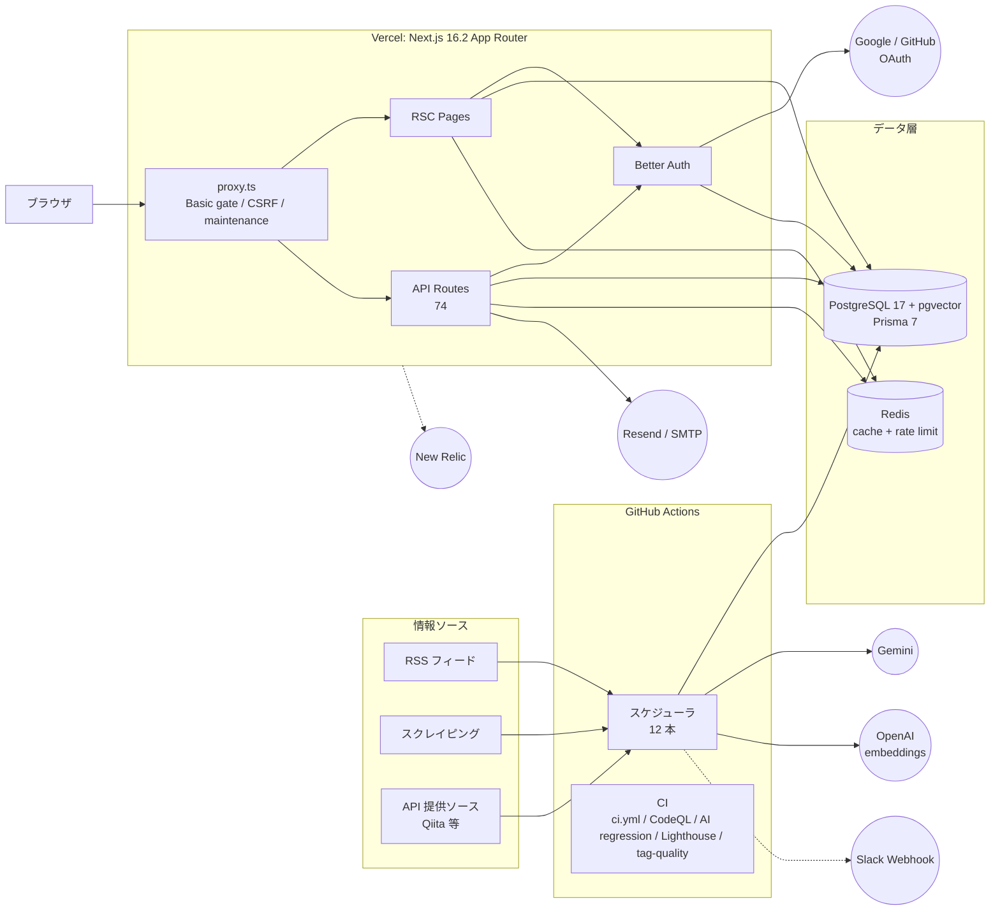
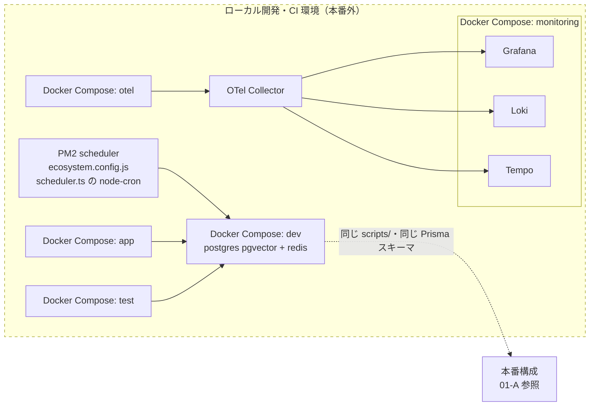

# システム全体構成

TechTrend の本番構成（01-A）と、ローカル開発・CI 専用の構成（01-B）を分けて示す。凡例は [索引](./README.md#凡例全図共通) を参照。

## 01-A 本番構成

情報ソースから記事を収集し、GitHub Actions のスケジューラが要約・埋め込みを生成、Vercel 上の Next.js アプリがユーザーに配信するまでの全体像。

### 読み方

| 図中のボックス | 実体 | 対応する env 変数 |
|----------------|------|-------------------|
| ブラウザ | エンドユーザーのクライアント | - |
| RSS フィード / スクレイピング / API 提供ソース | `Source` テーブル（76 件、4 大分類。2026-08-15 時点 dev DB）+ `lib/fetchers/` 各 fetcher | - |
| GitHub Actions スケジューラ 12 本 | `.github/workflows/scheduler-*.yml`（`npx tsx scripts/...` を本番 DB に対して直接実行、失敗時 Slack 通知） | `DATABASE_URL`, `SLACK_WEBHOOK_URL`, `GEMINI_API_KEY`, `OPENAI_API_KEY` |
| GitHub Actions CI | `ci.yml` / `codeql.yml` / `ai-regression-test.yml` / `lighthouse-ci.yml` / `tag-quality-check.yml` | - |
| proxy.ts | Next.js middleware（Basic 認証ゲート / CSRF / メンテナンスモード / 保護パスのセッションゲート） | `MAINTENANCE_MODE`, 署名 Cookie 用シークレット |
| RSC Pages | `app/` 配下の公開・認証必須・管理者ページ | - |
| API Routes | `app/api/` 配下 74 件の `route.ts` | - |
| Better Auth | `lib/auth/auth.ts`（email+password, admin プラグインで RBAC） | `AUTH_SECRET`（フォールバック `NEXTAUTH_SECRET`） |
| PostgreSQL 17 + pgvector | Prisma 7（`prisma/schema.prisma`, 31 model）。マネージド、提供元は注記参照 | `DATABASE_URL` |
| Redis | `lib/cache/`（LayeredCache: 用途別キャッシュ）+ `lib/rate-limiter.ts`（`getRedisClient()` 兼用） | `REDIS_URL` |
| Gemini | 要約・抽出（`lib/ai/`） | `GEMINI_API_KEY` |
| OpenAI embeddings | `text-embedding-3-small`（RAG, `lib/rag/`） | `OPENAI_API_KEY` |
| Resend / SMTP | メール送信（ダイジェスト等） | `RESEND_API_KEY`, `SMTP_HOST`/`SMTP_PORT`/`SMTP_USER`/`SMTP_PASSWORD`/`SMTP_SECURE` |
| Slack Webhook | バッチ失敗通知 | `SLACK_WEBHOOK_URL` |
| Google / GitHub OAuth | Better Auth 経由のソーシャルログイン | `GOOGLE_CLIENT_ID`/`GOOGLE_CLIENT_SECRET`, `GITHUB_CLIENT_ID`/`GITHUB_CLIENT_SECRET` |
| New Relic | 本番 APM（`instrumentation.ts` の `@vercel/otel` 経由。README.md:185） | `NEW_RELIC_LICENSE_KEY`, `NEW_RELIC_APP_NAME`（`docs/operations/monitoring-setup-phase2a.md:558-559`） |

## 01-B ローカル開発・CI 環境

Docker Compose と PM2 はローカル開発専用で、本番（Vercel + GitHub Actions）では動いていない。本番と同じ `scripts/` と `prisma/schema.prisma` を使う点だけが接続点。

### 読み方

| 図中のボックス | 実体 | 対応する env 変数 |
|----------------|------|-------------------|
| Docker Compose: dev | `docker-compose.dev.yml`（postgres pgvector/pg17 + redis:7-alpine） | `DATABASE_URL`, `REDIS_URL`（ローカル値） |
| Docker Compose: app / test / monitoring / otel | 同名の docker-compose ファイル群 | - |
| PM2 scheduler | `ecosystem.config.js` / `ecosystem.local.config.js`。`scripts/scheduled/scheduler.ts` の node-cron オーケストレータ | - |
| OTel Collector | `docker-compose.otel.yml`。`instrumentation.ts` の OTLP HTTP エクスポート先（ローカル時） | - |
| Grafana / Loki / Tempo | `docker-compose.monitoring.yml`。全ポート `127.0.0.1` バインドでローカル専用 | - |
| 本番構成（01-A 参照） | 同じ `scripts/` ディレクトリと `prisma/schema.prisma` を本番 GitHub Actions が実行 | - |

## 注記

- **本番 PostgreSQL の提供元は断定しない**。運用手順書 `docs/operations/rag-rollback-procedure.md` では Neon の操作（Snapshot 取得、`console.neon.tech`）を記載しているが、`docs/VERCEL_MIGRATION_SETUP.md` は Prisma Postgres（db.prisma.io）、`README.md` は Supabase と記述が混在しており、現行の提供元はコードからは確定できない [推測]。GitHub Actions は `secrets.DATABASE_URL` のみを参照しており、接続先そのものはワークフロー定義から特定できない
- **Upstash は図に載せていない**。`UPSTASH_REDIS_REST_URL`/`UPSTASH_REDIS_REST_TOKEN` は `lib/config/env.ts:123-125` に定義があるだけで、`lib`/`app`/`scripts` 配下に利用箇所はない（`grep -rn UPSTASH lib app scripts` で env.ts のみヒット）。レート制限・キャッシュはいずれも `REDIS_URL`（ioredis）経由の Redis 1 ノードで兼用している
- **PM2 の node-cron は本番では動いていない**（`scripts/scheduled/scheduler.ts:637` に「本番は GHA 側で実行」の注記あり）。本番バッチの実行主体は GitHub Actions スケジューラ 12 本のみ [推測: PM2 経路が実際に無効化されていることはコード中コメントに基づく]
- Source 76 件・4 大分類は 2026-08-15 時点の dev DB の値。取得コマンド: `docker exec techtrend-postgres psql -U postgres -d techtrend_dev -c 'SELECT COUNT(*), COUNT(*) FILTER (WHERE enabled) FROM "Source";'`
- API routes 74 件の取得コマンド: `find app/api -name route.ts | wc -l`
- GitHub Actions スケジューラ 12 本の取得コマンド: `ls .github/workflows/scheduler-*.yml | wc -l`

---
2026-08-15 時点のコードをもとに作成。更新ルールは [索引](./README.md) を参照。
