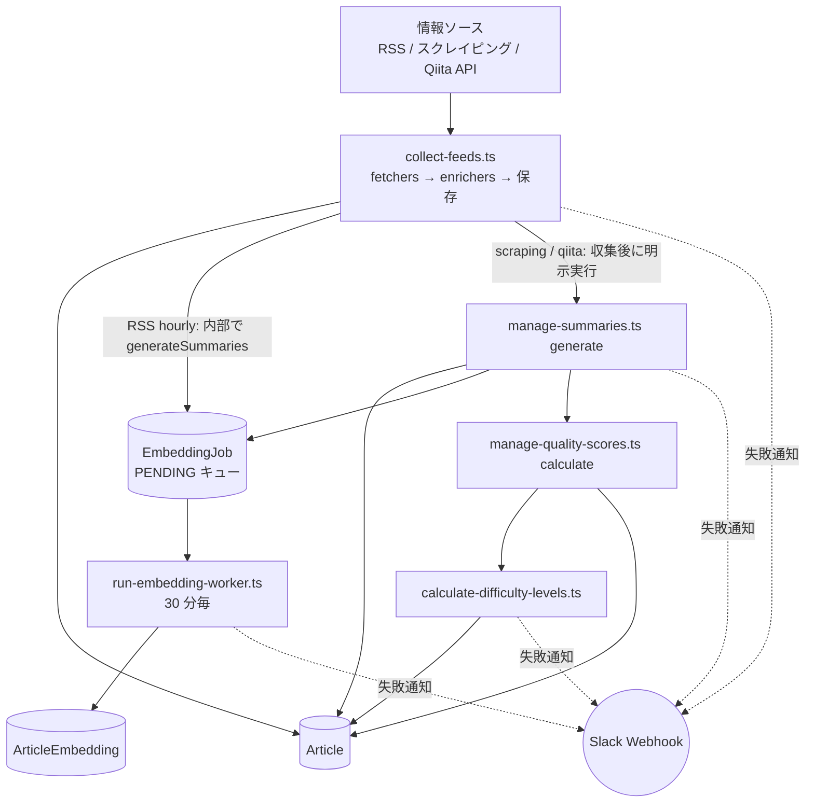
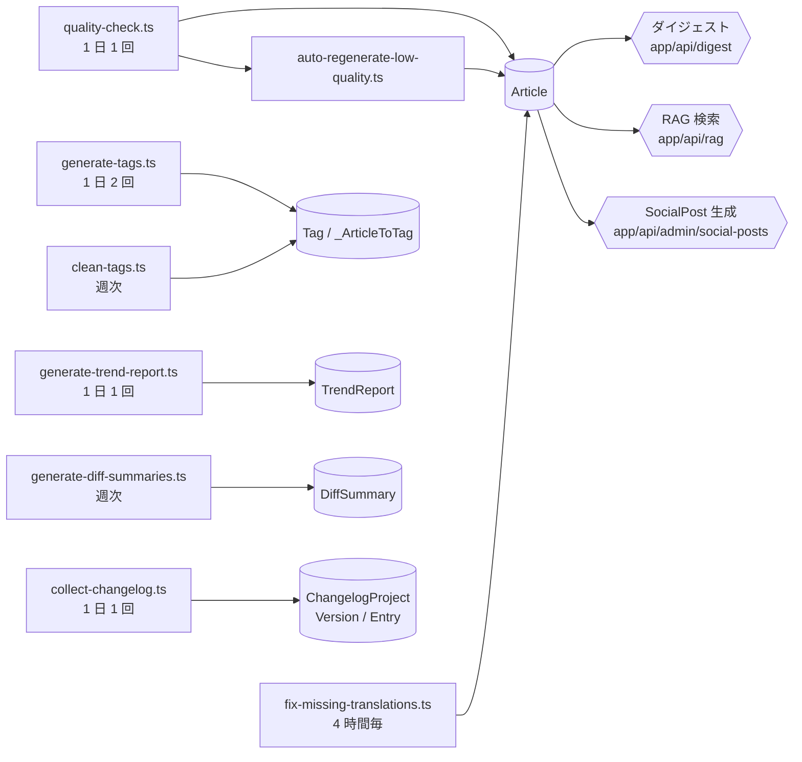

# バッチ・データパイプライン

記事が収集されてから要約・タグ付け・品質スコア・embedding・トレンドレポートになるまでの流れと、GitHub Actions の定期実行（12 本）を示す。図は主経路（02-A）と派生バッチ・オンデマンド処理（02-B）に分けている。凡例は [索引](./README.md#凡例全図共通) を参照。

## 02-A 記事収集の主経路

記事が入ってきてから要約・品質スコア・embedding が付くまで。**RSS hourly と scraping/qiita で経路が違う**点が要注意（下記の分岐ラベルを参照）。



`manage-quality-scores.ts` は `scheduler-daily-quality` からも単独で起動する（上図の経路以外にもう 1 つ入口がある）。

## 02-B 派生バッチとオンデマンド処理

主経路とは独立に走るバッチ群と、API から起動される処理（六角形）。



ここでは省略しているが、**12 本のワークフローはすべて失敗時に Slack へ通知する**（`if: failure()` ステップ。02-A に矢印で示したのと同じ仕組み）。各スクリプトの差分判定条件・出力マーカーは下の表を参照。

---

## 読み方

| 図中ノード | 実際のスクリプトパス | 実行契機 | 差分判定・出力マーカー |
|-----------|---------------------|---------|----------------------|
| `CollectFeeds` | `scripts/scheduled/collect-feeds.ts` | GHA cron（rss-hourly / scraping / qiita、各ワークフローに渡すソース名リストが異なる） | fetchers → enrichers → DB 保存。RSS hourly のみ、新規記事 ID を渡して内部で `generateSummaries`（`scripts/maintenance/generate-summaries.ts`）を呼び要約を即時生成する（`collect-feeds.ts:842`） |
| `ManageSummaries` | `scripts/scheduled/manage-summaries.ts generate` | scraping/qiita ワークフローのみ、`collect-feeds.ts` 実行後に明示的に呼ばれる | `summaryComputedAt >= 実行開始時刻` の記事を「今回処理した記事」として抽出し、Slack 通知の対象マーカーに使う（`manage-summaries.ts:151-155`） |
| `ManageQuality` | `scripts/scheduled/manage-quality-scores.ts calculate` | ①`scheduler-daily-quality`（単独、日次）②scraping/qiita ワークフロー内（`ManageSummaries` 直後） | `ProcessingLog` の前回実行時刻（`getLastProcessedTime`）をチェックポイントにし、`qualityScoreComputedAt IS NULL` または `qualityScore = 0` または `contentUpdatedAt > 前回実行時刻` の記事のみを処理対象にする（`manage-quality-scores.ts:100-123`） |
| `DifficultyLevels` | `scripts/scheduled/calculate-difficulty-levels.ts` | `ManageQuality` の直後（daily-quality / scraping / qiita 共通） | `Article` を取得し `$transaction` で難易度を書き戻す |
| `GenerateTags` | `scripts/scheduled/generate-tags.ts` | `scheduler-tags`（1 日 2 回） | `tags: { none: {} }`（タグ未付与）の記事を最大 25 件取得して処理 |
| `QualityCheck` → `AutoRegen` | `scripts/scheduled/quality-check.ts --days 7 --auto-regenerate` → `scripts/scheduled/auto-regenerate-low-quality.ts --threshold 70 --limit 10` | `scheduler-quality-auto`（1 日 1 回） | `QualityCheck` は過去 7 日分を走査し `updateMany` でフラグ更新、`AutoRegen` は `qualityScore < 70` の記事を再生成対象として抽出 |
| `FixTranslations` | `scripts/maintenance/fix-missing-translations.ts` | `scheduler-translation-fix`（4 時間毎） | `translatedTitle IS NULL` の記事のみ処理 |
| `EmbeddingWorker` | `scripts/dev/run-embedding-worker.ts`（`lib/workers/embedding-worker.ts` 経由で `lib/rag/article-embedding-pipeline.ts` を実行） | `scheduler-embedding-worker`（30 分毎） | `EmbeddingJob` の PENDING を処理し、`INSERT INTO "ArticleEmbedding"`（title/summary のみ）を実行。`ArticleChunk` へは書き込まない（注記参照） |
| `TrendReport` | `scripts/scheduled/generate-trend-report.ts` | `scheduler-trend-report`（1 日 1 回） | `TrendReportGenerator` サービスが `TrendReport` を生成 |
| `DiffSummary` | `scripts/ai/generate-diff-summaries.ts --week <ISO週> --force` | `scheduler-diff-summary`（週次、月曜 JST 06:00） | 対象週の記事から差分要約を `DiffSummary` に upsert。実行後 Redis の `@techtrend/cache:diff-summary*` キーを削除 |
| `Changelog` | `scripts/scheduled/collect-changelog.ts` | `scheduler-changelog`（1 日 1 回） | `ChangelogProject` → `ChangelogVersion`（upsert）→ `ChangelogEntry`（createMany）の順に書き込み |
| `CleanTags` | `scripts/scheduled/clean-tags.ts` | `scheduler-cleanup`（週次、土曜 JST 02:00） | 空タグ（記事 0 件）の `Tag` を `_ArticleToTag` ごと削除し、`TagCategoryMapping` に基づくタグ統合も実行 |

---

## 定期実行ワークフロー一覧

2026-08-15 時点、`.github/workflows/scheduler-*.yml` 全 12 本。

| workflow | cron (UTC) | JST | 実行スクリプト（YAML の実行順） | 主な書き込み先 |
|----------|-----------|-----|--------------------------------|----------------|
| `scheduler-rss-hourly` | `0 * * * *` | 毎時00分 | `collect-feeds.ts`（RSS 系ソース 70+ 件指定、内部で `generateSummaries` を実行） | `Article`（新規保存 + 要約）, `EmbeddingJob`（enqueue） |
| `scheduler-scraping` | `30 15 * * *`, `30 3 * * *` | 00:30, 12:30 | `collect-feeds.ts`（スクレイピング系）→ `manage-summaries.ts generate` → `manage-quality-scores.ts calculate` → `calculate-difficulty-levels.ts` | `Article`（保存・要約・品質スコア・難易度）, `EmbeddingJob` |
| `scheduler-qiita` | `5 20 * * *`, `5 8 * * *` | 05:05, 17:05 | `collect-feeds.ts`（Qiita Popular）→ 同上 3 本（同順） | `Article`, `EmbeddingJob` |
| `scheduler-tags` | `30 23 * * *`, `30 11 * * *` | 08:30, 20:30 | `generate-tags.ts` | `Tag`, `_ArticleToTag` |
| `scheduler-daily-quality` | `0 2 * * *` | 11:00 | `manage-quality-scores.ts calculate` → `calculate-difficulty-levels.ts` | `Article`（qualityScore/difficultyLevel と各 computedAt） |
| `scheduler-quality-auto` | `30 6 * * *` | 15:30 | `quality-check.ts --days 7 --auto-regenerate` → `auto-regenerate-low-quality.ts --threshold 70 --limit 10` | `Article`（品質フラグ・再生成後の要約/スコア） |
| `scheduler-translation-fix` | `30 */4 * * *` | 4時間毎（01:30, 05:30, 09:30, 13:30, 17:30, 21:30） | `fix-missing-translations.ts` | `Article`（translatedTitle 等） |
| `scheduler-embedding-worker` | `*/30 * * * *` | 30分毎（UTC と同一パターン） | `run-embedding-worker.ts` | `ArticleEmbedding` |
| `scheduler-trend-report` | `30 5 * * *` | 14:30 | `generate-trend-report.ts --type daily`（入力省略時） | `TrendReport` |
| `scheduler-changelog` | `15 3 * * *` | 12:15 | `collect-changelog.ts` | `ChangelogProject`, `ChangelogVersion`, `ChangelogEntry` |
| `scheduler-diff-summary` | `0 21 * * 0`（日曜） | 月曜06:00 | `generate-diff-summaries.ts --week <ISO週> --force` | `DiffSummary`（+ Redis `diff-summary*` キー削除） |
| `scheduler-cleanup` | `0 17 * * 5`（金曜） | 土曜02:00 | `clean-tags.ts` | `Tag`, `_ArticleToTag`（空タグ削除・統合） |

全 12 本とも `workflow_dispatch`（`confirm: YES` 入力必須）で手動起動も可能。全ワークフローに `if: failure()` の Slack 通知ステップがある。

---

## 注記

- **`ArticleChunk` はスキーマ上存在するが、現行パイプラインの書き込み対象外。** `prisma/schema.prisma` にモデル定義はあるが、`lib/rag/article-embedding-pipeline.ts` が生成するのは title/summary の `ArticleEmbedding` のみで、リポジトリ全体を検索しても `ArticleChunk` への `create`/`upsert`/`INSERT` は存在しない（確認: `grep -rn "articleChunk\.\(create\|upsert\)\|INSERT INTO \"ArticleChunk\"" lib app scripts` → 0 件）。
- **PM2（`ecosystem.config.js` の `scheduler.ts`、node-cron）と GitHub Actions は別々に定義された二重管理。** `scripts/scheduled/scheduler.ts` はローカル開発用に、RSS（毎時0分）・scraping（1日2回）・qiita（1日2回）・tags（1日2回）・quality-auto（1日1回）・cleanup（週次）・trend-report（1日1回、コメントで「本番はGHA」と明記）を **GHA とは独立した cron 定義で再実装**しており、両者を手動で同期する必要がある（`scripts/scheduled/scheduler.ts:430-650` 付近）。
  - 一方 embedding worker（`scripts/dev/run-embedding-worker.ts`）自体は PM2 側では 30 分毎に実行されて**いない**。PM2 が持つのは毎時15分の「stuck job リカバリ」（`EmbeddingScheduler.recoverStuckJobs`）のみで、`run-embedding-worker.ts` の定期実行定義は `scheduler-embedding-worker.yml`（GHA, 30分毎）のみが本番の唯一の起動元（`app/api/workers/embedding/route.ts` のコメントに「vercel.json に crons 定義はない」と明記）。スクリプト冒頭コメントの「production は Vercel Cron 経由」という記述は実態と異なる（[推測] ではなく `vercel.json` の中身 `{}` で確認済みの事実）。
- 数値・cron 値は 2026-08-15 時点のコードから取得。再取得コマンド:
  ```bash
  for f in .github/workflows/scheduler-*.yml; do echo "=== $f ==="; grep -n "cron:" "$f"; done
  ```

---

2026-08-15 時点のコードをもとに作成。更新ルールは [索引](./README.md) を参照。
