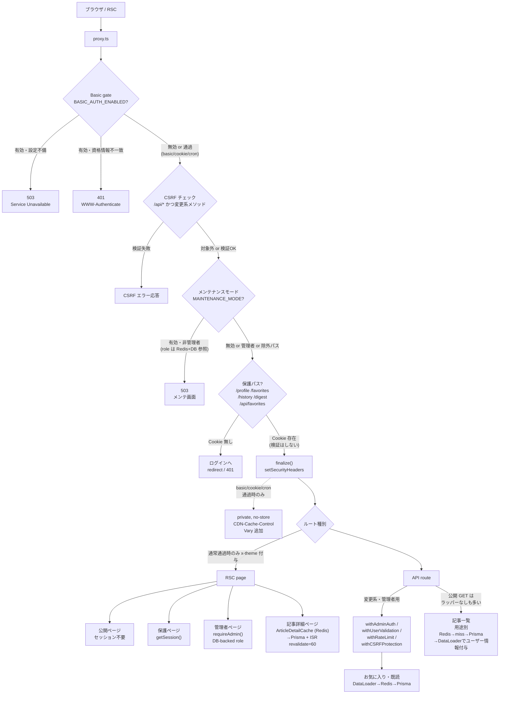
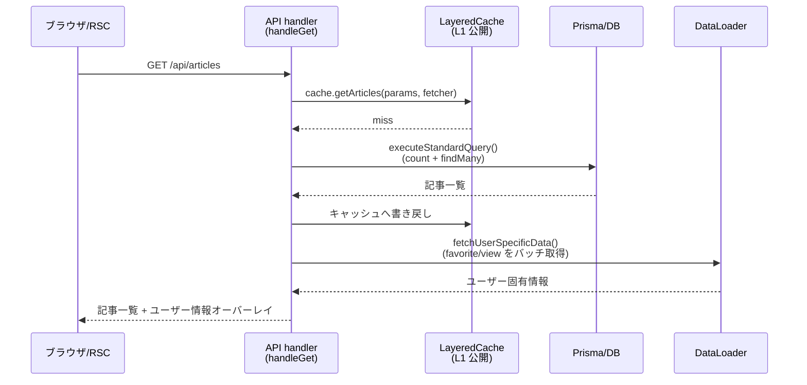

# リクエスト・キャッシュ・認証フロー

`proxy.ts` の分岐、経路別の認証方式、3 経路に分かれたキャッシュの流れを示します。範囲は「ブラウザ/RSC からのリクエストが応答を返すまで」です。

## リクエストの経路

### 読み方

- `proxy.ts` は全リクエスト共通の直列パイプラインではなく、**4 つの独立した条件分岐**です。各ゲートは有効化条件が異なり、無効時はスキップされます（Basic gate は `BASIC_AUTH_ENABLED` 時のみ、CSRF は `/api/*` の変更系メソッドのみ、メンテナンスは `MAINTENANCE_MODE` 時のみ、保護パスガードは対象パスのみ）。
- `finalize()` が付与する `Cache-Control: private, no-store` / `CDN-Cache-Control` / `Vary` 追加は、**Basic gate を通過したリクエスト（`gate.kind === 'basic' | 'cookie' | 'cron'`）のときだけ**実行されます。Basic 認証が無効な環境ではこれらのヘッダーは付与されません（`proxy.ts:120-146`）。
- 保護パスガード（`/profile` `/favorites` `/history` `/digest` `/api/favorites`）は**セッション Cookie の存在確認のみ**で、セッションの有効性やロールは検証していません。実際の検証は RSC 側の `getSession()` / `requireAdmin()` や API 側のラッパーで行われます。
- `setSecurityHeaders()` は `finalize()` 経由ですべての応答（503/401/リダイレクト含む）に適用されます。一方 `x-theme` ヘッダーは `finalize()` では付与されず、**ゲートに引っかからず通常通過したリクエストのときだけ**設定されます（`proxy.ts:254`）。CSRF エラー・メンテナンス 503・ログインリダイレクトには付きません。
- キャッシュは「記事一覧」「お気に入り・既読」「記事詳細」の 3 経路があり、`LayeredCache` の L1/L2/L3 は段階的フォールバック層ではなく、**すべて Redis を使う用途別キャッシュ**（L1 公開記事リスト / L2 ユーザー系 / L3 検索）です。
- **記事詳細の Redis キャッシュと ISR は RSC ページ側の仕組み**です（`app/articles/[id]/page.tsx:45` が `articleDetailCache.getArticleWithRelations()` を呼び、`:50` で `revalidate = 60` を宣言）。API 側で同じキャッシュを使うのは関連記事・関係グラフなど別ルートです。
- **すべての API がラッパーを通るわけではありません。** 例えば `app/api/articles/[id]/route.ts` の GET は素の `export async function GET` で、`withAdminAuth` + `withRateLimit` が付くのは同ファイルの PATCH / DELETE です。認証・レート制限の有無はルートごとに確認が必要です。
- DataLoader は 2 つとも**バッチ化**が主目的ですが、リクエスト内メモ化の扱いは異なります。favorite loader は DataLoader のキャッシュを有効にし（`lib/dataloader/favorite-loader.ts:221`）、view loader は `cache: false` で無効にしています（`lib/dataloader/article-view-loader.ts:135`）。

## 記事一覧取得のシーケンス

補足: クライアント側の React Query（画面での再取得・キャッシュ）は本図には含めていません。ブラウザ側の再フェッチ判断は React Query が担い、上記シーケンスはサーバー内の 1 リクエスト分の流れです。

## 対応コード

| 図中の要素 | ファイル:行番号 |
|-----------|----------------|
| Basic gate 判定・503/401 応答 | `proxy.ts:79-109` |
| `finalize()`（`private, no-store` / `CDN-Cache-Control` / `Vary`） | `proxy.ts:114-150`（ヘッダー付与本体は `:132-145`） |
| CSRF チェック（`/api/*` 変更系のみ） | `proxy.ts:152-160` |
| メンテナンスモード（管理者判定は Redis キャッシュ + DB） | `proxy.ts:162-218` |
| 保護パスガード（Cookie 存在確認のみ） | `proxy.ts:220-246` |
| `setSecurityHeaders()` / `x-theme` | `proxy.ts:148`, `proxy.ts:251-254`, `config/security-headers.ts` |
| 保護ページのセッション取得 | `lib/auth/get-session.ts:4-9`（`getSession()`） |
| 管理者ページの DB-backed role 検証 | `lib/auth/admin-check.ts:12-26`（`requireAdmin()`） |
| Better Auth 設定本体 | `lib/auth/auth.ts:51-186` |
| API 用ラッパー | `lib/middleware/with-admin-auth.ts:26`、`lib/middleware/with-user-validation.ts:71`、`lib/middleware/with-rate-limit.ts:58`、`lib/middleware/csrf-protection.ts:295` |
| `LayeredCache`（L1/L2/L3 = 用途別 Redis） | `lib/cache/layered-cache.ts:37-71` |
| 記事一覧キャッシュ呼び出し | `app/api/articles/handlers/get.ts:541-543`（`cache.getArticles(params, () => executeStandardQuery(...))`） |
| ユーザー情報オーバーレイ（DataLoader） | `app/api/articles/handlers/get.ts:558-565`（`fetchUserSpecificData`） |
| DataLoader ファクトリ | `lib/dataloader/index.ts:10-19`（`createLoaders()`） |
| ユーザー情報の DataLoader（オーバーレイで使うのはこの 2 つ） | `lib/dataloader/favorite-loader.ts:221`（`cache: true`）、`lib/dataloader/article-view-loader.ts:135`（`cache: false`）。呼び出しは `app/api/articles/lib/user-data.ts:36-49` |
| 記事詳細キャッシュ | `lib/cache/article-detail-cache.ts:10-18` |
| 記事詳細ページの ISR | `app/articles/[id]/page.tsx:50`（`export const revalidate = 60`） |

## 注記

- `revalidate = 60` の ISR は記事詳細ページ（`app/articles/[id]/page.tsx`）にのみ適用されます。記事更新時は `articleDetailCache.invalidate()` から `revalidatePath` も呼ばれます（`page.tsx:49` のコメント参照）。
- クライアント側の React Query は本図の対象外です（上記シーケンス図の補足を参照）。
- `Cache-Control: private, no-store` / `CDN-Cache-Control` / `Vary` の付与は Basic gate 通過時（`gate.kind === 'basic' | 'cookie' | 'cron'`）のみで、Basic 認証が無効な構成では付与されません。
- 保護パスガード（`/profile` 等）は Cookie の**存在確認のみ**であり、セッションの有効性やロールの検証はしていません。実際の検証は各ページ・API ハンドラ側（`getSession()` / `requireAdmin()` / ラッパー）で行われます。

---
2026-08-15 時点のコードをもとに作成。更新ルールは [索引](./README.md) を参照。
