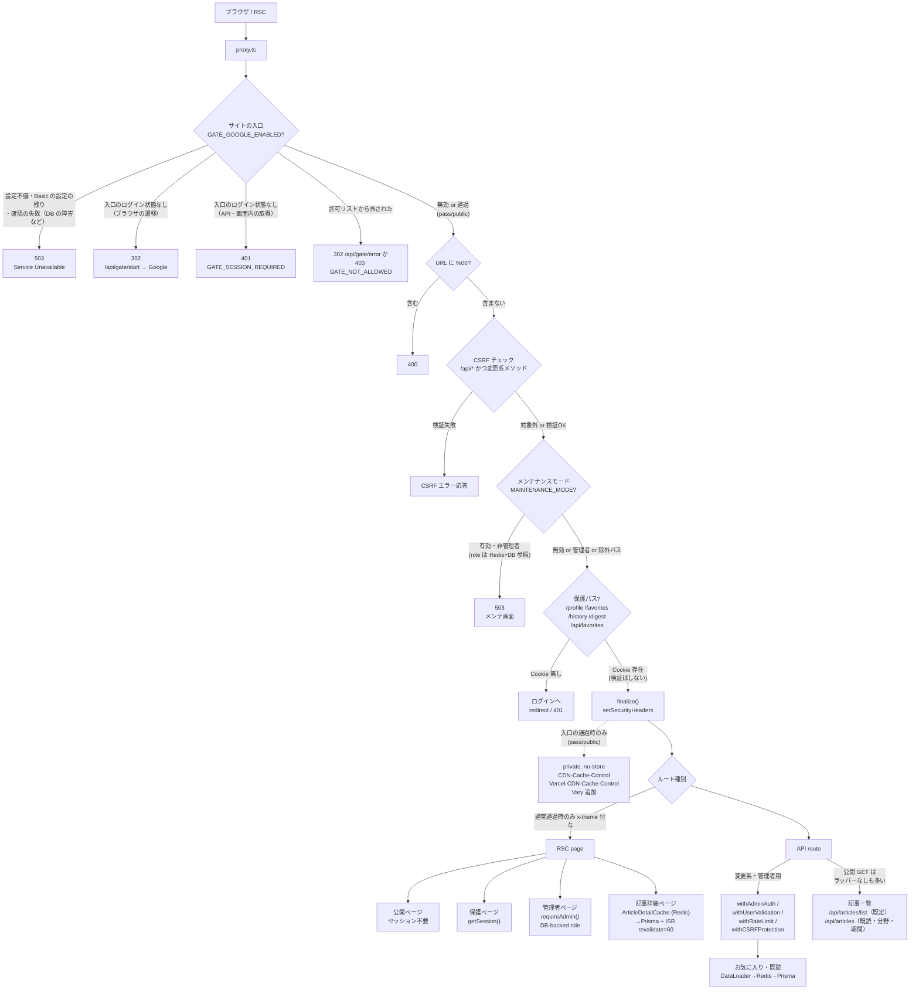
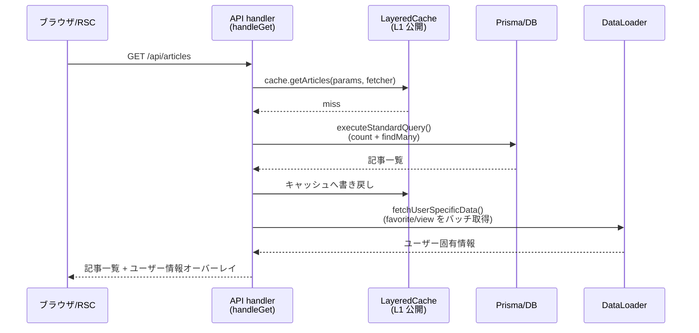

# リクエスト・キャッシュ・認証フロー

`proxy.ts` の分岐、経路別の認証方式、3 経路に分かれたキャッシュの流れを示します。範囲は「ブラウザ/RSC からのリクエストが応答を返すまで」です。

## リクエストの経路

```mermaid
flowchart TD
    Browser["ブラウザ / RSC"] --> Proxy["proxy.ts"]

    Proxy --> SiteGate{"サイトの入口<br/>GATE_GOOGLE_ENABLED?"}
    SiteGate -->|"設定不備・Basic の設定の残り<br/>・確認の失敗（DB の障害など）"| Err503["503<br/>Service Unavailable"]
    SiteGate -->|"入口のログイン状態なし<br/>（ブラウザの遷移）"| GateStart["302<br/>/api/gate/start → Google"]
    SiteGate -->|"入口のログイン状態なし<br/>（API・画面内の取得）"| Err401["401<br/>GATE_SESSION_REQUIRED"]
    SiteGate -->|"許可リストから外された"| Err403["302 /api/gate/error か<br/>403 GATE_NOT_ALLOWED"]
    SiteGate -->|"無効 or 通過<br/>(pass/public)"| Nul{"URL に %00?"}
    Nul -->|"含む"| Err400["400"]
    Nul -->|"含まない"| Csrf{"CSRF チェック<br/>/api/* かつ変更系メソッド"}

    Csrf -->|"検証失敗"| ErrCsrf["CSRF エラー応答"]
    Csrf -->|"対象外 or 検証OK"| Maint{"メンテナンスモード<br/>MAINTENANCE_MODE?"}

    Maint -->|"有効・非管理者<br/>(role は Redis+DB 参照)"| Err503b["503<br/>メンテ画面"]
    Maint -->|"無効 or 管理者 or 除外パス"| Protected{"保護パス?<br/>/profile /favorites<br/>/history /digest<br/>/api/favorites"}

    Protected -->|"Cookie 無し"| Redirect["ログインへ<br/>redirect / 401"]
    Protected -->|"Cookie 存在<br/>(検証はしない)"| Finalize["finalize()<br/>setSecurityHeaders"]

    Finalize -.->|"入口の通過時のみ<br/>(pass/public)"| GateHeaders["private, no-store<br/>CDN-Cache-Control<br/>Vercel-CDN-Cache-Control<br/>Vary 追加"]

    Finalize --> RouteType{"ルート種別"}
    RouteType -->|"通常通過時のみ x-theme 付与"| RSC["RSC page"]
    RouteType --> ApiRoute["API route"]

    RSC --> PublicPage["公開ページ<br/>セッション不要"]
    RSC --> ProtectedPage["保護ページ<br/>getSession()"]
    RSC --> AdminPage["管理者ページ<br/>requireAdmin()<br/>DB-backed role"]
    RSC --> ArticleDetail["記事詳細ページ<br/>ArticleDetailCache (Redis)<br/>→Prisma + ISR revalidate=60"]

    ApiRoute -->|"変更系・管理者用"| ApiWrap["withAdminAuth /<br/>withUserValidation /<br/>withRateLimit /<br/>withCSRFProtection"]
    ApiRoute -->|"公開 GET は<br/>ラッパーなしも多い"| ArticleList["記事一覧<br/>/api/articles/list（既定）<br/>/api/articles（既読・分野・期間）"]
    ApiWrap --> FavHistory["お気に入り・既読<br/>DataLoader→Redis→Prisma"]
```

### 読み方

- `proxy.ts` は全リクエスト共通の直列パイプラインではなく、**5 つの独立した条件分岐**です。各ゲートは有効化条件が異なり、無効時はスキップされます（サイトの入口は `GATE_GOOGLE_ENABLED` が true のとき（Vercel の Production では未設定も有効）のみ、NUL の拒否は URL に `%00` を含むときのみ、CSRF は `/api/*` の変更系メソッドのみ、メンテナンスは `MAINTENANCE_MODE` 時のみ、保護パスガードは対象パスのみ）。
- `finalize()` が付与する `Cache-Control: private, no-store` / `CDN-Cache-Control` / `Vercel-CDN-Cache-Control` / `Vary` 追加は、**サイトの入口を通過したリクエスト（`gate.kind === 'pass' | 'public'`）のときだけ**実行されます。入口のログイン状態の確認が返した Set-Cookie もここで載せます。`/_next/image` はこの処理から外します（キャッシュの打ち消しも Cookie もしない）。入口が無効な環境ではこれらのヘッダーは付与されません（`proxy.ts:142-188`）。route 側でも、入口が有効になりうるときは `lib/api/cache-headers.ts` が公開キャッシュのヘッダーを private に変えます。
- 保護パスガード（`/profile` `/favorites` `/history` `/digest` `/api/favorites`）は**セッション Cookie の存在確認のみ**で、セッションの有効性やロールは検証していません。実際の検証は RSC 側の `getSession()` / `requireAdmin()` や API 側のラッパーで行われます。
- サイトの入口は、入口用の Better Auth（DB なし。ログイン状態は暗号化した Cookie `tt-gate.*` に持ち、最初のログインから 7 日で切れて延びない）と、許可リスト（`GateAllowedEmail`。管理画面 `/admin/gate-access` で管理）で判定します（`lib/auth/site-gate/evaluate.ts`）。入口の Cookie が無ければ DB に触れずに拒否し、あれば Gmail・Google のメールの確認・許可リストの 3 つを照らします。許可の結果だけをプロセス内に 30 秒持つので、外したアドレスは最長 30 秒で入れなくなり、足したアドレスはすぐ入れます。設定で固定したアドレス（`GATE_ALWAYS_ALLOWED_EMAILS`）は DB を読まずに通します。ログインの開始は `/api/gate/start`（IP ごとに 30 回/分、ポリシー `auth:gate-start`）。入口の外から通すのは、開始・Google からの戻り・拒否のページの GET と、アプリ内のログアウトの POST、拒否のページからの利用の申請の POST（`/api/gate/request`）だけです。未登録の Gmail で拒否したとき（Google からの戻りと、許可リストから外された人への 302）は、そのアカウントのアドレスを署名付きの Cookie で拒否のページへ渡し、利用の申請を受け付けます（フォームのアドレスの欄にそのアカウントを入れておき、申請者は別の Gmail アドレスに書き換えられます。申請は `GateAccessRequest` に入り、管理者が許可するまで入れません）。
- `setSecurityHeaders()` はすべての応答に適用されます。サイトの入口の 503・302・401・403 は `finalize()` を通らず直接呼び（`proxy.ts:65`, `:134-138`）、それ以外（CSRF エラー・メンテナンス 503・リダイレクトを含む）は `finalize()` 経由です。一方 `x-theme` ヘッダーは `finalize()` では付与されず、**ゲートに引っかからず通常通過したリクエストのときだけ**設定されます（`proxy.ts:317`）。
- キャッシュは「記事一覧」「お気に入り・既読」「記事詳細」の 3 経路があり、`LayeredCache` の L1/L2/L3 は段階的フォールバック層ではなく、**すべて Redis を使う用途別キャッシュ**（L1 公開記事リスト / L2 ユーザー系 / L3 検索）です。
- **記事詳細の Redis キャッシュと ISR は RSC ページ側の仕組み**です（`app/articles/[id]/page.tsx:53` が `articleDetailCache.getArticleWithRelations()` を呼び、`:58` で `revalidate = 60` を宣言）。API 側で同じキャッシュを使うのは関連記事・関係グラフなど別ルートです。
- **すべての API がラッパーを通るわけではありません。** 例えば `app/api/articles/[id]/route.ts` の GET は素の `export async function GET` です。認証・レート制限の有無はルートごとに確認が必要です（一覧は [05 機能一覧](./05-features.md#4-api66本)）。
- DataLoader は 2 つとも**バッチ化**が主目的ですが、リクエスト内メモ化の扱いは異なります。favorite loader は DataLoader のキャッシュを有効にし（`lib/dataloader/favorite-loader.ts:221`）、view loader は `cache: false` で無効にしています（`lib/dataloader/article-view-loader.ts:135`）。

## 記事一覧取得のシーケンス

ホームの一覧は、条件によって 2 つの API を使い分けます（`lib/articles/home-articles-query.ts:194-204`）。

- **既定**: `/api/articles/list`（軽量版）。`RedisCache`（namespace `@techtrend/cache:api:lightweight`、`app/api/articles/list/cache-config.ts`）を使う
- **既読・興味の分野・期間で絞るとき**: `/api/articles`。下の図はこちらの流れ。興味の分野（`categoryIds`）は「選んだ分野の点数（`ArticleInterestScore`）を持つ」条件と期間として where に足し（`app/api/articles/lib/query-builder.ts` の `withInterestFilter`）、通常の一覧と同じキャッシュを通る。既読の絞り込みはキャッシュを通らない

ホームの 1 ページ目は、RSC が同じプロセスの中で route handler を直接呼ぶので、`proxy.ts` を通りません（`app/components/home/prefetch-home-articles.ts:144-146`）。

```mermaid
sequenceDiagram
    participant C as ブラウザ/RSC
    participant A as API handler<br/>(handleGet)
    participant L1 as LayeredCache<br/>(L1 公開)
    participant DB as Prisma/DB
    participant DL as DataLoader

    C->>A: GET /api/articles
    A->>L1: cache.getArticles(params, fetcher)
    L1-->>A: miss
    A->>DB: executeStandardQuery()<br/>(count + findMany)
    DB-->>A: 記事一覧
    A->>L1: キャッシュへ書き戻し
    A->>DL: fetchUserSpecificData()<br/>(favorite/view をバッチ取得)
    DL-->>A: ユーザー固有情報
    A-->>C: 記事一覧 + ユーザー情報オーバーレイ
```

補足: クライアント側の React Query（画面での再取得・キャッシュ）は本図には含めていません。ブラウザ側の再フェッチ判断は React Query が担い、上記シーケンスはサーバー内の 1 リクエスト分の流れです。

## 対応コード

| 図中の要素 | ファイル:行番号 |
|-----------|----------------|
| サイトの入口の判定・503/302/401/403 応答（判定の本体は `lib/auth/site-gate/evaluate.ts`、許可リストの照合は `lib/auth/site-gate/allowlist.ts`、設定の検証は `lib/auth/site-gate/config.ts`） | `proxy.ts:100-138` |
| `finalize()`（`private, no-store` / `CDN-Cache-Control` / `Vercel-CDN-Cache-Control` / `Vary`） | `proxy.ts:142-188`（ヘッダー付与本体は `:158-183`） |
| NUL バイト（`%00`）の拒否 | `proxy.ts:196-209` |
| CSRF チェック（`/api/*` 変更系のみ） | `proxy.ts:211-219` |
| メンテナンスモード（管理者判定は Redis キャッシュ + DB） | `proxy.ts:221-276` |
| 保護パスガード（Cookie 存在確認のみ） | `proxy.ts:278-309` |
| `setSecurityHeaders()` / `x-theme` | `proxy.ts:186`, `proxy.ts:311-320`, `lib/config/security-headers.ts` |
| 保護ページのセッション取得 | `lib/auth/get-session.ts:4-9`（`getSession()`） |
| 管理者ページの DB-backed role 検証 | `lib/auth/admin-check.ts:12-26`（`requireAdmin()`） |
| Better Auth 設定本体 | `lib/auth/auth.ts:51-191` |
| API 用ラッパー | `lib/middleware/with-admin-auth.ts:41`、`lib/middleware/with-user-validation.ts:77`、`lib/middleware/with-rate-limit.ts:75`、`lib/middleware/csrf-protection.ts:295` |
| `LayeredCache`（L1/L2/L3 = 用途別 Redis） | `lib/cache/layered-cache.ts:50-79` |
| 軽量版の記事一覧（ホームの既定） | `app/api/articles/list/route.ts`、キャッシュは `app/api/articles/list/cache-config.ts` |
| 記事一覧キャッシュ呼び出し | `app/api/articles/handlers/get.ts:419-421`（`cache.getArticles(cacheParams, () => executeStandardQuery(...))`）。興味の分野で絞るときも同じ |
| ユーザー情報オーバーレイ（DataLoader） | `app/api/articles/handlers/get.ts:435`（`fetchUserSpecificData`） |
| DataLoader ファクトリ | `lib/dataloader/index.ts:10-19`（`createLoaders()`） |
| ユーザー情報の DataLoader（オーバーレイで使うのはこの 2 つ） | `lib/dataloader/favorite-loader.ts:221`（`cache: true`）、`lib/dataloader/article-view-loader.ts:135`（`cache: false`）。呼び出しは `app/api/articles/lib/user-data.ts:37-53` |
| 記事詳細キャッシュ | `lib/cache/article-detail-cache.ts:10-18` |
| 記事詳細ページの ISR | `app/articles/[id]/page.tsx:58`（`export const revalidate = 60`） |

## 注記

- `revalidate = 60` の ISR は記事詳細ページ（`app/articles/[id]/page.tsx`）にのみ適用されます。記事更新時は `articleDetailCache.invalidateArticle()`（`lib/cache/article-detail-cache.ts:274`）から `revalidatePath` も呼ばれます。
- クライアント側の React Query は本図の対象外です（上記シーケンス図の補足を参照）。
- `Cache-Control: private, no-store` / `CDN-Cache-Control` / `Vary` の付与はサイトの入口の通過時（`gate.kind === 'pass' | 'public'`）のみで、入口が無効な構成では付与されません。
- 保護パスガード（`/profile` 等）は Cookie の**存在確認のみ**であり、セッションの有効性やロールの検証はしていません。実際の検証は各ページ・API ハンドラ側（`getSession()` / `requireAdmin()` / ラッパー）で行われます。

---
2026-08-15 時点のコードをもとに作成し、2026-11-25 時点のコードに合わせて更新。更新ルールは [索引](./README.md) を参照。
