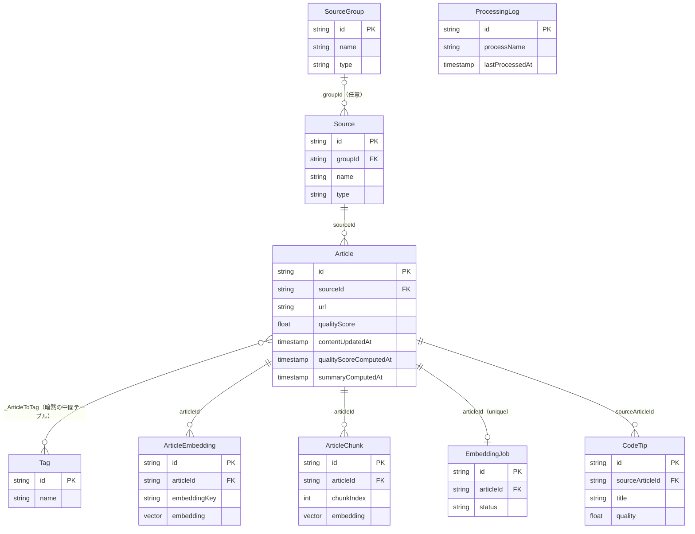
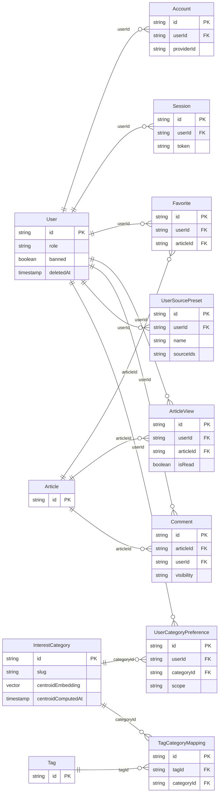

# データモデル概要

31 model（2026-08-15 時点）のうち、`Article` を中心に実際の Prisma `@relation` でつながるものだけを抜き出し、コア記事系（04-A）とユーザー・パーソナライズ系（04-B）の 2 図に分けて示す。関係を持たない/薄い独立系テーブルは図に含めず、末尾の表にまとめた。

---

## 04-A コア記事系

### 読み方

- **Article**: 記事本体。`qualityScore` は品質スコア、`contentUpdatedAt`/`qualityScoreComputedAt`/`summaryComputedAt` は各バッチが差分判定・完了マーキングに使う個別タイムスタンプ
- **Source**: 記事の収集元（RSS/スクレイピング/API）。`groupId` は任意（`SourceGroup` に属さない Source もある）
- **SourceGroup**: Source を分類するグループ
- **Tag**: 記事タグ。`Article` とは暗黙の中間テーブル `_ArticleToTag` による多対多（Prisma が自動生成、schema.prisma 上に明示モデルはない）
- **ArticleEmbedding**: 記事の embedding（title/summary/content 単位、`EmbeddingKey` で区別）。`embedding` は pgvector の `vector(1536)` 型
- **ArticleChunk**: 記事本文をチャンク分割した embedding 用テーブル。スキーマ上は `Article` と 1:多の関係を持つが、**現行の embedding パイプラインは書き込まない**（注記参照）
- **EmbeddingJob**: embedding 生成の実行キュー。1 記事につき最大 1 ジョブ（`articleId` が unique）
- **CodeTip**: 記事から抽出したコード断片。`Article` への実 `@relation`（`sourceArticleId`、cascade）を持つため本図に配置（計画上は独立系テーブル表に予定していたが、schema.prisma 確認により本図へ変更。詳細は末尾の報告を参照）。なお `lib/ai/extraction/extraction-schemas.ts` に抽出用スキーマはあるが、[未確認] DB への `create`/`upsert` 呼び出しはリポジトリ内で確認できず、現時点で実データを持たない可能性がある
- **ProcessingLog**: バッチの最終実行時刻・処理件数を記録する独立テーブル。**Prisma の `@relation` を一切持たない**ため図中では関係線なしの単独ボックスとして表示。`processName`（一意キー）でバッチ側が論理的に参照する

---

## 04-B ユーザー・パーソナライズ系

### 読み方

- **User**: アプリのユーザー。`role` は `"user"`/管理者ロール、`deletedAt` は論理削除
- **Account** / **Session**: Better Auth が管理する認証情報・セッション。いずれも `userId` に `onDelete: Cascade`
- **Favorite**: お気に入り登録（`userId`+`articleId` で一意）
- **ArticleView**: 既読/閲覧履歴。`isRead` で既読フラグを持つ
- **Comment**: 記事への個人メモ。`visibility` で公開/非公開を区別
- **UserSourcePreset**: ユーザーが保存したソースフィルタ設定。`sourceIds` は `String[]`（**`Source` への Prisma `@relation` ではなく ID 配列を保持するだけの論理参照**）。そのため本図では `Source` への関係線を引いていない
- **InterestCategory**: パーソナライズ用の興味カテゴリ。`centroidEmbedding` は pgvector の `vector(1536)` 型（カテゴリの重心ベクトル）
- **UserCategoryPreference**: ユーザーごとのカテゴリ重み付け（`scope` で home/digest を区別）
- **TagCategoryMapping**: `Tag`—`InterestCategory` の中間テーブル（`schema.prisma:415-421`）
- **Article** / **Tag**: 04-A の実体を参照用に再掲（属性は PK のみ）

---

## AI 派生・独立テーブル

`Article`/`User` への実 `@relation` を持たない、または独立した用途のテーブル。

| モデル | 用途 | 生成元（書き込み箇所） | 他テーブルとの関係 |
|--------|------|----------------------|-------------------|
| `DiffSummary` | カテゴリ別の週次差分サマリー（AI生成） | `lib/ai/diff-summary/diff-summary-service.ts`（`scripts/ai/generate-diff-summaries.ts`、週次） | `@relation` なし。`categorySlug`/`currentPeriod` は論理キー |
| `TrendReport` | 日次/週次/月次トレンドレポート（AI生成） | `lib/services/trend-report/trend-report-generator.ts`（`generate-trend-report.ts`、日次） | `@relation` なし。`topArticles`/`tags` は Json で記事情報を保持 |
| `SocialPost` | X（Twitter）投稿下書きの管理 | `lib/social-post/social-post-service.ts`（`app/api/admin/social-posts/*` からオンデマンド生成） | `@relation` なし。`sourceIds` は `String[]` の論理参照（`Article` 等への FK ではない） |
| `SocialPostAuditLog` | `SocialPost` の操作監査ログ | 同上 `social-post-service.ts` 内（`socialPostAuditLog.create`） | `SocialPost` への `@relation`（`onDelete: SetNull`）を持つ。他系列とは独立 |
| `ViewpointMap` | トピック別の論点マップ（AI生成） | [未確認] `lib/ai/extraction/extraction-schemas.ts` に出力スキーマ（zod）はあるが、DB への `create`/`upsert` 呼び出しはリポジトリ内で確認できず | `@relation` なし。`articleIds` は `String[]` の論理参照 |
| `ChangelogProject` → `ChangelogVersion` → `ChangelogEntry` | OSS/製品の変更履歴収集（親: プロジェクト、子: バージョン、孫: 変更点） | `scripts/scheduled/collect-changelog.ts`（`scheduler-changelog`、日次） | 3 モデルは互いに `@relation` を持つ独立系。`ChangelogProject 1 - N ChangelogVersion 1 - N ChangelogEntry`（いずれも `onDelete: Cascade`）。`Article`/`User` への関係はない |
| `UserDeletionLog` | ユーザー退会・削除の監査ログ | `lib/auth/utils.ts`、`app/api/admin/users/[id]/route.ts`（自己退会・管理者削除時） | `@relation` なし。`userId`/`email` は削除後も残すためスナップショット的に保持（論理参照） |
| `Verification` | Better Auth のメール確認トークン管理 | Better Auth ライブラリ内部（`lib/auth/auth.ts` の `emailVerification` 設定経由）。アプリコードから直接書き込まない | `@relation` なし |
| `SourceTag` / `SourceTagAssignment` | ソースへのタグ付け（`Tag`/`InterestCategory` の記事タグとは別系統） | [未確認] `SourceTagAssignment` は `Source`/`SourceTag` への `@relation` を持つが、現行の書き込み箇所（管理画面 API 等）はリポジトリ内で確認できず | `SourceTagAssignment` は `Source`（04-A）と `SourceTag` の双方に `@relation`（`onDelete: Cascade`）を持つ。ただし `Article`/`User` へは繋がらないため図には含めていない |

---

## 注記

- **pgvector を使うフィールドは 3 つ**: `ArticleEmbedding.embedding`、`ArticleChunk.embedding`、`InterestCategory.centroidEmbedding`。いずれも `Unsupported("vector(1536)")`（1536 次元）。Mermaid の `erDiagram` は型に `()` を使えないため、図上は `vector embedding` のように次元を省略して表記している
- pgvector 拡張を追加したマイグレーション: `prisma/migrations/20251018154552_add_article_embeddings/migration.sql`
- **`ArticleChunk` は現行パイプラインでは書き込まれない**: embedding 生成の実装 `lib/rag/article-embedding-pipeline.ts` が書き込むのは `ArticleEmbedding` のみで、`ArticleChunk` への `create`/`upsert`/`INSERT` はリポジトリ内に存在しない（`grep -rn 'articleChunk\.(create|upsert)|INSERT INTO "ArticleChunk"' lib app scripts` で確認）。スキーマ上は将来のチャンク分割 RAG 用に残っている
- model 総数: **31**（2026-08-15 時点）。取得コマンド: `grep -c '^model ' prisma/schema.prisma`
- 全 31 model の完全な列挙・カラム定義は `prisma/schema.prisma` を参照

---

2026-08-15 時点の `prisma/schema.prisma` をもとに作成。更新ルールは [索引](./README.md) を参照。
