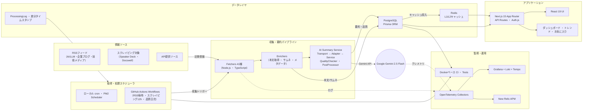

<!-- _class: title -->
<!-- _paginate: false -->

# TechTrend 開発状況アップデート

2025/10/XX @tomoaki  
個人開発で進化させている技術記事アグリゲーター

---

<!-- _class: section -->
<!-- _paginate: false -->

## 今日話すこと
- プロダクトの現状スナップショット
- データパイプラインとAI要約の工夫
- 直近の改善ハイライトと運用状況
- 次に試したいアイデアと欲しいフィードバック

---

# プロダクト概要

- 技術記事アグリゲーター「TechTrend」を個人開発で運用中
- 収集ソース: 41件（AI/LLM 6・企業ブログ13・技術メディア22）
- 蓄積記事数: 開発10,013件 / 本番3,897件
- タグ総数: 8,611件（人気タグはAI/AWS/JavaScriptなど技術系に最適化）
- スケジュール: RSS毎時・スクレイピング12時間・品質スコア日次で自動更新

---

# ユーザー向け価値

- 一覧要約 / 詳細要約 / タグ / 品質スコアを自動生成しトレンドを素早く把握
- `/popular` `/trends` `/digest` `/dashboard/performance` で多角的に記事を探索
- お気に入り・未読管理・ダークモード・メール通知（nodemailer v7）を提供
- 国内外ソースを統一UIで横断し、技術ニュースレター的に活用できる

---

<!-- _class: content-image -->

# データパイプライン

- 情報源 → Fetchers(41) → Enrichers(全文/メタデータ) → AI Summary Service  
- Transport → Adapter → Service + QualityChecker → PostProcessor の分離構成  
- PostgreSQL + ProcessingLog で差分処理 / Redis + DataLoader で多層キャッシュ  
- Next.js 15 App Router + Prisma / Auth.js / Tailwind / shadcn/ui

---

# システム全体構成図

---

# AI要約と品質管理

- Gemini 2.5 Flash を採用、指数バックオフと自動リトライを実装
- INSTRUCTION_PATTERNS 22種でプロンプト混入を完全ブロック
- フォールバック要約も指示文サニタイズ＋情報保持を両立
- Quality Checker で言語・文字数・禁止フレーズを検査し再生成を自動化
- Google/AWS向け専用エンリッチメントで短文RSS問題を解消（500文字以上確保）

---

# 直近の改善ハイライト（2025年10月）

- ユーザー削除API: ソフトデリート＋監査ログ＋JWT即時無効化
- Strict CSP / Permissions-Policy / HSTS を middleware へ統合しXSS耐性を強化
- GitHub Actions: Prisma migrate タイムアウトと YAML 構文エラーを同時解消
- 企業ブログのデータ欠落・短文化を修正し17記事を再エンリッチ
- タグ品質監視ワークフローでソース依存タグを自動検出＆是正

---

# 運用・信頼性

- GitHub Actions スケジューラが安定稼働（RSS毎時/スクレイピング12時間/品質日次）
- Dockerベースの CI で Build/Lint/Unit/E2E をフル自動化（1,812テスト成功）
- Dependabot / CodeQL アラートはゼロ、セキュリティヘッダ強化フェーズ完了
- ProcessingLog + タイムスタンプで障害時の差分再実行が容易
- OpenTelemetry + Grafana/Tempo/Loki + New Relic でトレースとメトリクスを可視化

---

# 次に挑戦したいこと

- Mastra を使った「vibes検索」エージェント  
  - 要約・タグをベクトル化し曖昧クエリから雰囲気で探せる検索を実装予定
- 海外速報翻訳フローの整備  
  - 要約＋出典リンク中心、権利面に配慮した許諾プロセスを検討
- プロンプトA/B と難易度推定のダッシュボード化
- プレミアム要約 / データAPI / コミュニティ運営などマネタイズ実験

---

<!-- _class: section -->
<!-- _paginate: false -->

## フィードバック募集中
- vibes検索で実現したい体験・サンプルクエリ・UIアイデア
- 翻訳速報で欲しい粒度、注意したい権利面のポイント
- あると嬉しい指標や画面改善案、コラボしたい記事ソース
- 運用や自動化で気付いたこと、試してみたい検証アイデア

---

<!-- _class: all-text-center align-center -->
<!-- _paginate: false -->

# ありがとうございました！

質問・感想はお気軽にどうぞ 🙌
